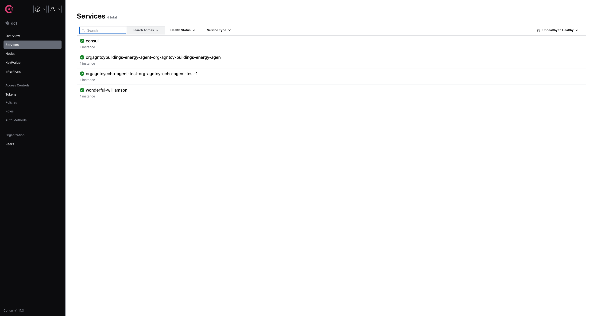

# IOA Service Discovery

**Considerations:** Should we approach discovery at the protocol level or discovery at the infrastructure level.

- **Protocol Level**: CoAp style discovery where agents can discover other agents by sending a multicast message. This is similar to how mDNS works.

- **Infrastructure Level**: Utilize docker and Kubernetes to discover services.

## Overview
This project follows the infrastructure level approach, defining a docker container scanner (go docker-client) for local environments and a Kubernetes service scanner (and agent CRD operator) for cluster environments. Once services are discovered:
1.  Check if the service is an IOA agent
2.  Check what agent protocol it uses (ACP, AP, A2A, etc.)
3.  Recursively check for sub agents (if any) and their protocols by inspecting the openapi specs.
4.  Create a consul service record

## Getting Started (Docker)

Navigate to the `docker` directory.

1.  Build and run the docker service discovery container and consul container:
```bash
docker-compose up
```

2. Deploy some agents
```bash
wfsm deploy --manifestPath deploy/echo-agent.json --envFilePath deploy/echo_agent_example.yaml
```

3. Navigate to the consul UI at `http://localhost:8500` to see the discovered services.



Note: The service discovery container uses the host network mode, to ensure containers are discovered, expose the ports of the agents to the host. 